* Table of Contents
{:toc}

--------------------------------------------------------------------------------------------------------------------

## **Acknowledgements**

This project is based on the AddressBook-Level3 project created by the [SE-EDU initiative](https://se-education.org).

--------------------------------------------------------------------------------------------------------------------

## **Setting up, getting started**

Refer to the guide [_Setting up and getting started_](SettingUp.md).

--------------------------------------------------------------------------------------------------------------------

## **Design**

:bulb: **Tip:** The `.puml` files used to create diagrams in this document can be found in the [diagrams](https://github.com/AY2223S1-CS2103T-W15-4/tp/tree/master/docs/diagrams/) folder. Refer to the [_PlantUML Tutorial_ at se-edu/guides](https://se-education.org/guides/tutorials/plantUml.html) to learn how to create and edit diagrams.

### Architecture

The ***Architecture Diagram*** given above explains the high-level design of the App.

Given below is a quick overview of main components and how they interact with each other.

**Main components of the architecture**

**`Main`** has two classes called [`Main`](https://github.com/AY2223S1-CS2103T-W15-4/tp/blob/master/src/main/java/friday/Main.java) and [`MainApp`](https://github.com/AY2223S1-CS2103T-W15-4/tp/blob/master/src/main/java/friday/MainApp.java). It is responsible for,
* At app launch: Initializes the components in the correct sequence, and connects them up with each other.
* At shut down: Shuts down the components and invokes cleanup methods where necessary.

[**`Commons`**](#common-classes) represents a collection of classes used by multiple other components.

The rest of the App consists of four components.

* [**`UI`**](#ui-component): The UI of the App.
* [**`Logic`**](#logic-component): The command executor.
* [**`Model`**](#model-component): Holds the data of the App in memory.
* [**`Storage`**](#storage-component): Reads data from, and writes data to, the hard disk.

**How the architecture components interact with each other**

The *Sequence Diagram* below shows how the components interact with each other for the scenario where the user issues the command `delete 1`.

Each of the four main components (also shown in the diagram above),

* defines its *API* in an `interface` with the same name as the Component.
* implements its functionality using a concrete `{Component Name}Manager` class (which follows the corresponding API `interface` mentioned in the previous point.

For example, the `Logic` component defines its API in the `Logic.java` interface and implements its functionality using the `LogicManager.java` class which follows the `Logic` interface. Other components interact with a given component through its interface rather than the concrete class (reason: to prevent outside component's being coupled to the implementation of a component), as illustrated in the (partial) class diagram below.

The sections below give more details of each component.

### UI component

The **API** of this component is specified in [`Ui.java`](https://github.com/AY2223S1-CS2103T-W15-4/tp/blob/master/src/main/java/friday/ui/Ui.java)

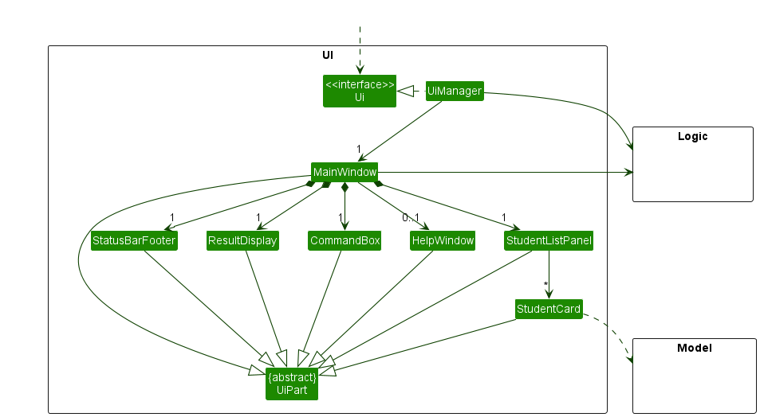

The UI consists of a `MainWindow` that is made up of parts e.g.`CommandBox`, `ResultDisplay`, `StudentListPanel`, `StatusBarFooter` etc. All these, including the `MainWindow`, inherit from the abstract `UiPart` class which captures the commonalities between classes that represent parts of the visible GUI.

The `UI` component uses the JavaFx UI framework. The layout of these UI parts are defined in matching `.fxml` files that are in the `src/main/resources/view` folder. For example, the layout of the [`MainWindow`](https://github.com/AY2223S1-CS2103T-W15-4/tp/blob/master/src/main/java/friday/ui/MainWindow.java) is specified in [`MainWindow.fxml`](https://github.com/AY2223S1-CS2103T-W15-4/tp/blob/master/src/main/resources/view/MainWindow.fxml)

The `UI` component,

* executes user commands using the `Logic` component.
* listens for changes to `Model` data so that the UI can be updated with the modified data.
* keeps a reference to the `Logic` component, because the `UI` relies on the `Logic` to execute commands.
* depends on some classes in the `Model` component, as it displays `Student` object residing in the `Model`.

### Logic component

**API** : [`Logic.java`](https://github.com/AY2223S1-CS2103T-W15-4/tp/blob/master/src/main/java/friday/logic/Logic.java)

Here's a (partial) class diagram of the `Logic` component:

How the `Logic` component works:
1. When `Logic` is called upon to execute a command, it uses the `FridayParser` class to parse the user command.
1. This results in a `Command` object (more precisely, an object of one of its subclasses e.g., `AddCommand`) which is executed by the `LogicManager`.
1. The command can communicate with the `Model` when it is executed (e.g. to add a student).
1. The result of the command execution is encapsulated as a `CommandResult` object which is returned back from `Logic`.

The Sequence Diagram below illustrates the interactions within the `Logic` component for the `execute("delete 1")` API call.

:information_source: **Note:** The lifeline for `DeleteCommandParser` should end at the destroy marker (X) but due to a limitation of PlantUML, the lifeline reaches the end of diagram.

Here are the other classes in `Logic` (omitted from the class diagram above) that are used for parsing a user command:

How the parsing works:
* When called upon to parse a user command, the `FridayParser` class creates an `XYZCommandParser` (`XYZ` is a placeholder for the specific command name e.g., `AddCommandParser`) which uses the other classes shown above to parse the user command and create a `XYZCommand` object (e.g., `AddCommand`) which the `FridayParser` returns back as a `Command` object.
* All `XYZCommandParser` classes (e.g., `AddCommandParser`, `DeleteCommandParser`, ...) inherit from the `Parser` interface so that they can be treated similarly where possible e.g, during testing.

### Model component
**API** : [`Model.java`](https://github.com/AY2223S1-CS2103T-W15-4/tp/blob/master/src/main/java/friday/model/Model.java)

The `Model` component,

* stores the FRIDAY data i.e., all `Student` objects (which are contained in a `UniqueStudentList` object).
* stores the currently 'selected' `Student` objects (e.g., results of a search query) as a separate _filtered_ list which is exposed to outsiders as an unmodifiable `ObservableList<Student>` that can be 'observed' e.g. the UI can be bound to this list so that the UI automatically updates when the data in the list change.
* stores a `UserPref` object that represents the user’s preferences. This is exposed to the outside as a `ReadOnlyUserPref` objects.
* does not depend on any of the other three components (as the `Model` represents data entities of the domain, they should make sense on their own without depending on other components)

:information_source: **Note:** An alternative (arguably, a more OOP) model is given below. It has a `Tag` list in the `Friday`, which `Student` references. This allows `Friday` to only require one `Tag` object per unique tag, instead of each `Student` needing their own `Tag` objects. 

### Storage component

**API** : [`Storage.java`](https://github.com/AY2223S1-CS2103T-W15-4/tp/blob/master/src/main/java/friday/storage/Storage.java)

The `Storage` component,
* can save both FRIDAY data and user preference data in json format, and read them back into corresponding objects.
* inherits from both `FridayStorage` and `UserPrefStorage`, which means it can be treated as either one (if only the functionality of only one is needed).
* depends on some classes in the `Model` component (because the `Storage` component's job is to save/retrieve objects that belong to the `Model`)

### Common classes

Classes used by multiple components are in the `friday.commons` package.

--------------------------------------------------------------------------------------------------------------------

## **Implementation**

This section describes some noteworthy details on how certain features are implemented.

### Sort feature
#### Rationale
Students in FRIDAY have details such as name, Telegram handle, consultation and Mastery Check dates, and grades.
This feature enables the sorting of students using the aforementioned details as criteria. With many students to keep track of, we
decided to add this feature to allow users to quickly organize their students in different ways.

#### Implementation

The current implementation of the sort feature allows users to sort all students based on the given criteria, in ascending
or descending order. The classes corresponding to the current list of criteria are: `Name`, `TelegramHandle`, `Consultation`,
`MasteryCheck`, and `Grade`.

In this section, we will use the following Activity Diagram to outline the process when the `sort` command is executed.

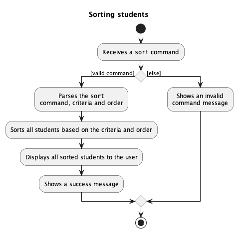

The `sort` command will be executed by `SortCommand`. Before that, `SortCommandParser` uses instances of `Prefix` and
`Order` in `CliSyntax` to parse the user input and decide what comparator is passed to `SortCommand`. The sorted list
is stored as `sortedStudents` in `ModelManager`, and is updated every time `SortCommand` is run.

To assist with the sorting, classes `Name`, `TelegramHandle`, `Consultation`, and `MasteryCheck` implement the `Comparable`
interface, where the natural ordering of `String` and `LocalDate` are used to implement the `compareTo` method. The `Grade`
class does not implement the interface as its attributes are `String`s.

Given below is an example usage scenario and how the sort mechanism behaves at each step.

1. FRIDAY initialises an `ObservableList<Student>` named `students` and
   a `SortedList<Student>` named `sortedStudents` upon launch.

2. The user executes `sort n/a` command to sort the students by name in ascending order.

3. The user input is passed to
   `LogicManager`, which then calls the `SortCommandParser#parse` method to parse the argument `n/a`.

4. The `SortCommandParser` checks that the criteria and order are valid, and creates a `SortCommand` with a `Comparator`
   that orders the student names alphabetically.

5. The `LogicManager` calls the `SortCommand#execute` method, which in turn calls  `Model#updateSortedStudentList`
   to update `sortedStudents` with the given `Comparator`.

6. The list `students` is set to `sortedStudents`, after which  `CommandResult` is returned by the `SortCommand` to signal success.

7. The `StudentListPanel#setList` method is called to refresh the
   `ListView` in the UI with the new `students` list, and the success message from `CommandResult` is displayed.

The following Sequence Diagram summarises the aforementioned steps.

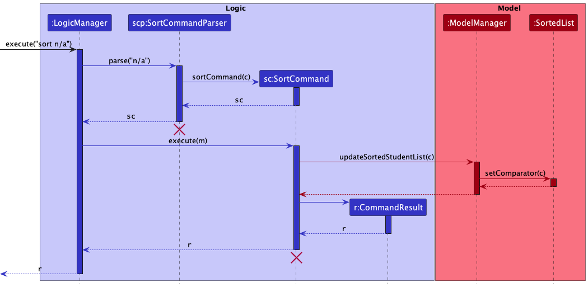

#### Design considerations

**Aspect: How many criteria should the `sort` command accept**

|                                                                                 | **Pros**                                                                                     | **Cons**                                                                                                   |
|---------------------------------------------------------------------------------|----------------------------------------------------------------------------------------------|------------------------------------------------------------------------------------------------------------|
| **Option 1 (current choice)**   Accept only one criterion                    | Easier to implement and also clearer for the user                                            | Unable to further sort students with a secondary criteria should the first criteria of some students match |
| **Option 2**   Accept multiple criteria and sort in the order they are given | More precise sorting when many students have matching details, e.g. same Mastery Check dates | Sorting becomes confusing for the user and difficult to implement if many criteria are given               |

### Alias feature
#### Rationale
Some advanced users might want to customise the command words.
This feature will allow them to do so, enabling these users to be more efficient in using FRIDAY.

#### Implementation
The current implementation of the alias feature will allow users to add a non-empty one word alias for a [default command](#glossary).

The following activity diagram will outline the process when the `alias` command is executed.

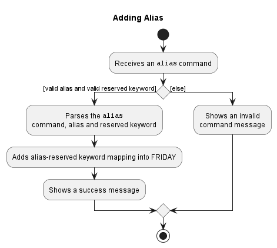

The alias command will be executed by `AliasCommand`. Aliases added will be stored in a `AliasMap`, while
default command names (e.g. add, delete) will be stored in a constant `LIST_RESERVED_KEYWORD` in the `ReservedKeyword` class.

Given below is an example usage scenario and how the alias mechanism behaves at each step.

1. The user launches the application for the first time. FRIDAY will initialise a `Friday`
with an empty `AliasMap`.

2. The user executes `alias a/ls k/list` command to add an alias `ls` for the default command `list`. `FridayParser` will parse
`alias` and create a new `AliasCommandParser`.`AliasCommandParser` will parse `a/ls k/list` and create an `AlliasCommand` with `Alias("ls")`
and a `ReservedKeyword("list")`. When executing the `AliasCommand`, the command will check that `list` is in the `LIST_RESERVED_KEYWORD`,`ls` is not in the
`AliasMap` and `ls` is a valid alias. After all the conditions are fulfilled, `Model#addAlias(Alias("ls"), ReservedKeyword("list"))` will be called to add
this alias-keyword mapping into `AliasMap`.

3. The user executes `ls` using the alias of the `list` command. `Model#getKeyword("ls")` will check `AliasMap` in `Model`
for an alias-keyword mapping. As there is a mapping of `ls` to `list`, `Model#getKeyword("ls")` will return `list`.
`list` will then be assigned to `commandWord` in `FridayParser`. `commandWord` will then be used to get the command to be executed.
`ListCommand` will then be executed.

The following sequence diagram shows how the alias `ls` is used to execute the default command `list`.
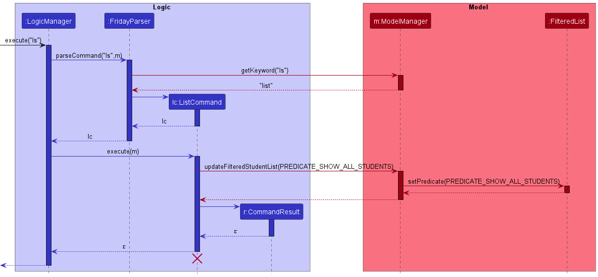

#### Design considerations

**Aspect: How `Alias` is stored in `AliasMap`:**

|                                                                                          | **Pros**                       | **Cons**                                                                                                                                                                                     |
|------------------------------------------------------------------------------------------|--------------------------------|----------------------------------------------------------------------------------------------------------------------------------------------------------------------------------------------|
| **Option 1 (current choice)**   Stored as an Alias-ReservedKeyword mapping in a Map   | Fast with O(1) time complexity | At high capacity, there might be complications due to collision in Map                                                                                                                       |
| **Option 2**   Alias and ReservedKeyword stored within an association class in a List | Can store more Aliases         | To get an Alias, iteration through the whole list must be done causing the time complexity to be at O(Number of Aliases) and this might cause performance issues when there are many aliases |
_

### Grade Feature
#### Rationale
FRIDAY allows the user to record their students' grades for assessments and examinations in CS1101S. There are 5
assessments in CS1101S, namely Reading Assessment 1 (RA1), Reading Assessment 2 (RA2), Practical Assessment, Midterm
exam, and the Final exam. Each student in FRIDAY will have a list of their grades for the 5 assessments, showing the
name of the assessment and the student's score for the assessment. Users are able to view and edit the individual
students' grades for the assessments.

#### Implementation
The `grade` command is executed by `GradeCommand`. In CS1101S, the 5 main examinations are Reading Assessment 1, Reading Assessment 2, Practical Assessment, Midterm exam, and Final exam, which are denoted by "ra1", "ra2", "pa", "mt", and "ft" respectively.

For each student, there are 5 grades, each with the result scored by the student, in percentages between 0% and 100% inclusive, and up to 2 decimal places, and the name of the examination it is associated with.
The grades are then stored in a `GradesList` which is unique for every student and has a fixed length of 5 for every student managed by the user.

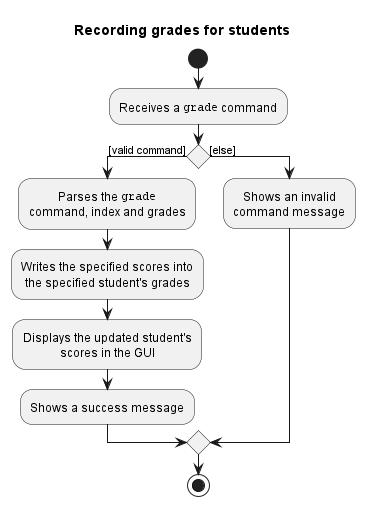

The 5 grades are stored as `Grade` objects in a unique `GradesList` for each student. `GradesList` uses a `HashMap` for
the data structure in storing the `Grade` objects as it allows for fast access of the individual grades. It is also
useful for potential future implementation where there may be more grades in the module, hence allowing FRIDAY to be
expandable and adaptable for such possible scenarios. `ArrayList` is only utilised when the order of the grades is
necessary, such as when displaying the grades in the GUI and for storage purposes.

Given below is an example usage scenario and how the grading mechanism behaves at each step.

1. The user executes the `grade 5 ra1/90 pa/69.90` command to edit the grades of Reading Assessment 1 and
Practical Assessment for the 5th student in FRIDAY. `GradeCommandParser` checks that the command is valid, and searches for the specific scores from the user's input using the `Prefix` of the examinations. `GradeCommandParser` then creates a new `EditGradeDescriptor` which is then used to create the new `GradeCommand`.

2. The `GradeCommand` will access the `GradesList` of the specified student and the individual grades specified by the user. The `GradesList` is updated, where Reading Assessment 1 and Practical Assessment examinations are updated with the new scores, and the other examinations have the same scores as before.

The following Sequence Diagram summarises the aforementioned steps.

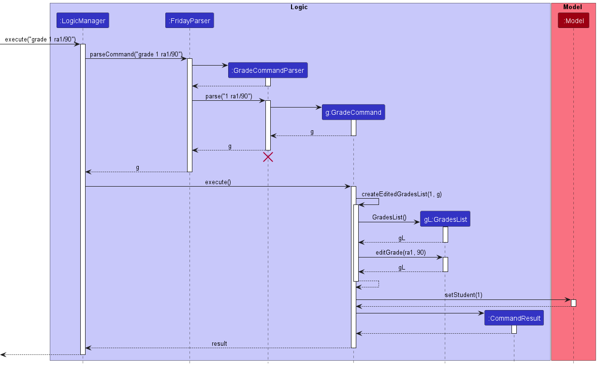

#### Design considerations

**Aspect: Should we allow users to determine the examinations**

|                                                                                                 | **Pros**                                                                                                                           | **Cons**                                                                                                                                                                                      |
|-------------------------------------------------------------------------------------------------|------------------------------------------------------------------------------------------------------------------------------------|-----------------------------------------------------------------------------------------------------------------------------------------------------------------------------------------------|
| **Option 1 (current choice)**   Fix the examinations in the list of grades for every student | Standardised for every student, without the need to check, create or delete examinations for every student, and easy to implement. | Less freedom for users. Unaccounted for unforeseen circumstances (e.g. There is a change in the assessments for the CS1101S module).                                                          |
| **Option 2**   Allow users to create and delete their own examinations                       | Provides freedom for users and flexibility for changes in the grading system of the module.                                        | Not standardised for every student, and more prone to user error, as each examination will thus need to create new unique prefixes and identity to know which examination it is referring to. |

**Aspect: Should we allow users to set the scores of each grade in their own way (e.g. "99%", "A", "65/70", etc.)**

|                                                                                             | **Pros**                                                                                                                                         | **Cons**                                                                                                                                                                                                                                   |
|---------------------------------------------------------------------------------------------|--------------------------------------------------------------------------------------------------------------------------------------------------|--------------------------------------------------------------------------------------------------------------------------------------------------------------------------------------------------------------------------------------------|
| **Option 1 (current choice)**   Standardise scoring of each grade in terms of percentage | Standardised and neat for every assessment and for every student, applicable for the 5 assessments in the CS1101S module, and easy to implement. | Less flexible for assessments whereby percentage scores are not applicable. (e.g. Pass/Fail assessments, alphabetical grading, etc.), and the possible need to manually calculate the percentage.                                          |
| **Option 2**   Users can input the scores in any String they desire                      | More flexibility and freedom for user                                                                                                            | Very difficult to check for valid scores due to large number of possibility, not standardised for every student and grade, less able to compare the students' strengths and weaknesses in certain assessments, and difficult to implement. |

### Find feature
#### Rationale
FRIDAY allows the user to search through all the fields entered for any student and outputs a modified list of students that match the criteria. This list can then be modified and the changes will be reflected in the storage used.
This can be used to search for a particular student based on keywords.

#### Implementation
The find command is executed similar to all other commands. It goes through the parser and is interpreted using the
logic established. However, it is unique in the sense that it will look through all the possible fields and data
and return matches.

Below is the activity diagram depicting how the find function is implemented

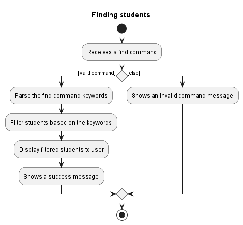

The `find` command will be executed by `FindCommand`. Before that, `FindCommandParser` parses the user input and decide what predicate is passed to `FindCommand`. The filtered list
is stored as `filteredStudents` in `ModelManager`, and is updated every time `FindCommand` is run.

Given below is an example usage scenario and how the sort mechanism behaves at each step.

1. FRIDAY initialises an `ObservableList<Student>` named `students` and
   a `FilteredList<Student>` named `filteredStudents` upon launch.

2. The user executes `find keyword` command to sort the students by name in ascending order.

3. The user input is passed to
   `LogicManager`, which then calls the `FindCommandParser#parse` method to parse the argument `keyword`.

4. The `FindCommandParser` checks that the criteria is valid, and creates a `FindCommand` with a `Predicate`
   that is used to filter the students list.

5. The `LogicManager` calls the `FindCommand#execute` method, which in turn calls  `Model#updateFilteredStudentList`
   to update `sortedStudents` with the given `Predicate`.

6. The list `students` is set to `filteredStudents`, and the `StudentListPanel#setList` method is called to refresh the
   `ListView` in the UI with the new `students` list.

The following sequence diagram summarizes the aforementioned steps.

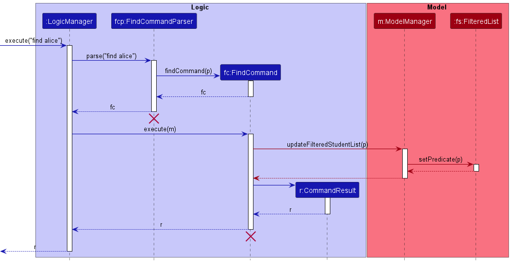

#### Design considerations

**Aspect: Should we allow users to find block keywords :**

|                                                                          | **Pros**                                                                   | **Cons**                                                                        |
|--------------------------------------------------------------------------|----------------------------------------------------------------------------|---------------------------------------------------------------------------------|
| **Option 1 (current choice)**   Allow user to find by single keywords | Provides more search results and the expected student is part of the list. | The expected student may not appear at the top of the list due to lexicography. |
| **Option 2**   Allow users to find by block keywords                  | Possibly more accurate searches.                                           | Higher possibly that search is unsuccessful due to error in keywords.           |

### Mark feature
#### Rationale
FRIDAY allows users to mark the Mastery Checks of certain students as passed. This would help the user keep track of which students have already completed and passed their Mastery Checks.

#### Implementation
The mark command is implemented by a `MarkMasteryCheckCommand`. The `MasteryCheck` of a student contains a boolean `isPassed`, which is set to false by default for sample students and when a student is added to the list.

Below is an activity diagram depicting the implementation of the mark command.

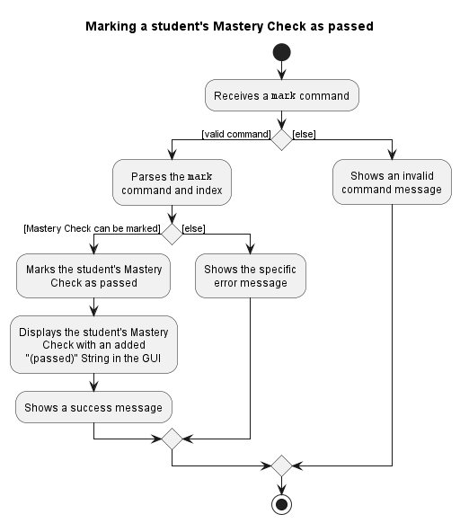

The `MarkMasteryCheckCommand` checks for the following conditions to determine if the student's Mastery Check can be marked as passed:
1. The given student's Mastery Check is not empty.
2. The given student's Mastery Check has not already been marked as passed.
3. The given student's Mastery Check date is not beyond the current date.
   * e.g. A student with their Mastery Check scheduled for 2030-09-01 cannot be marked as passed if the current date is 2022-11-07.

Only if all 3 of these conditions are met will the `MarkMasteryCheckCommand` set `isPassed` of the given student's Mastery Check to `true`, hence marking it as passed.

Given below is an example usage scenario and how the marking mechanism behaves at each stage.

1. The user launches the application for the first time. FRIDAY will open with a list populated with sample students whose Mastery Checks have `isPassed` set to `false` by default.
2. The user executes the `mark 1` command to mark the Mastery Check of the first student as passed. `MarkMasteryCheckCommandParser` checks that the command is valid. If so, it creates a new `MarkMasteryCheckCommand` with 1 as the `index`.
3. The `MarkMasteryCheckCommand` checks student 1's Mastery Check for the 3 conditions listed above. Since student 1's Mastery Check meets all 3 of these conditions, the `MarkMasteryCheckCommand` sets the value of the student's Mastery Check's `isPassed` to `true`.

The following Sequence Diagram summarises the aforementioned steps.

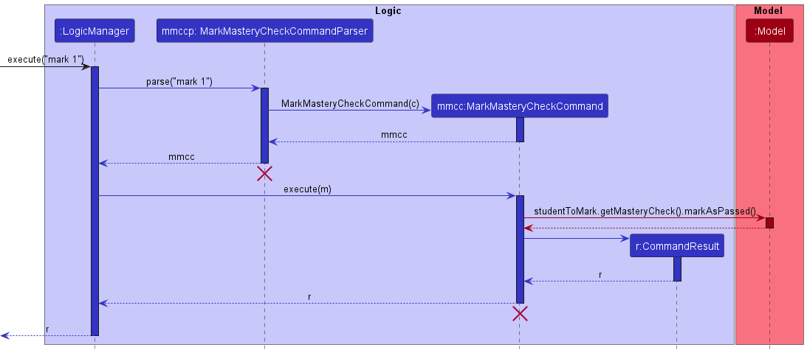

#### Design considerations

**Aspect: Should we allow users to mark empty Mastery Checks as passed**

|                                                                                 | **Pros**                                                                                                           | **Cons**                                                                                                                                                                                                                |
|---------------------------------------------------------------------------------|--------------------------------------------------------------------------------------------------------------------|-------------------------------------------------------------------------------------------------------------------------------------------------------------------------------------------------------------------------|
| **Option 1 (current choice)**   Do not allow marking of empty Mastery Checks | More intuitive and makes more sense                                                                                | May be useful in certain cases                                                                                                                                                                                          |
| **Option 2**   Allow marking of empty Mastery Checks                         | Could be useful in certain cases, for example when a student is exempted from having to complete the Mastery Check | These cases are rare. Also does not make sense to allow this as there is an empty Mastery Check means that the student has not scheduled or completed any Mastery Check. Hence, there is nothing to be marked as passed |

### Unmark feature
#### Rationale
FRIDAY allows users to unmark the Mastery Checks of certain students as passed. This would be useful in cases where the user accidentally marks the Mastery Check of a student who has not passed their Mastery Check.

#### Implementation
The unmark command is implemented by an `UnmarkMasteryCheckCommand`. As mentioned above the `MasteryCheck` of a student contains a boolean `isPassed`, which is set to false by default but can be changed to `true` by a `MarkMasteryCheckCommand`.

Below is an activity diagram depicting how the unmark command is implemented.

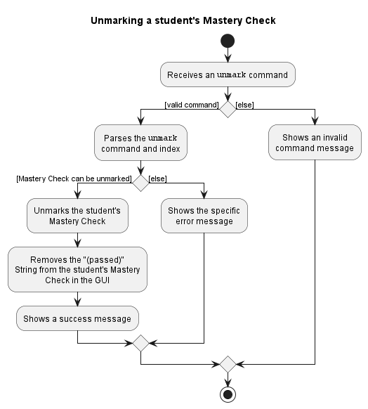

The `UnmarkMasteryCheckCommand` checks for the following conditions to determine if the student's Mastery Check can be unmarked:
1. The given student's Mastery Check is not empty.
2. The given student's Mastery Check has already been marked as passed.

Only if both of these conditions are met will the `UnmarkMasteryCheckCommand` set `isPassed` of the given student's Mastery Check to `false`, hence unmarking it as passed.

Given below is an example usage scenario and how the marking mechanism behaves at each stage.

1. The user launches the application for the first time. FRIDAY will open with a list populated with sample students whose Mastery Checks have `isPassed` set to `false` by default.
2. The user executes the `mark 1` command to mark the Mastery Check of the first student as passed.
3. The user realises this was a mistake, as they actually wanted to mark the Mastery Check of another student as passed.
4. The user executes the `unmark 1` command to unmark the Mastery Check of the first student. `UnmarkMasteryCheckCommandParser` checks that the command is valid. If so, it creates a new `UnmarkMasteryCheckCommand` with 1 as the `index`.
5. The `UnmarkMasteryCheckCommand` checks student 1's Mastery Check for the 2 conditions listed above. Since student 1's Mastery Check meets both of these conditions, the `UnmarkMasteryCheckCommand` sets the value of the student's Mastery Check's `isPassed` to `false`.

The following Sequence Diagram summarises steps 4 to 5.

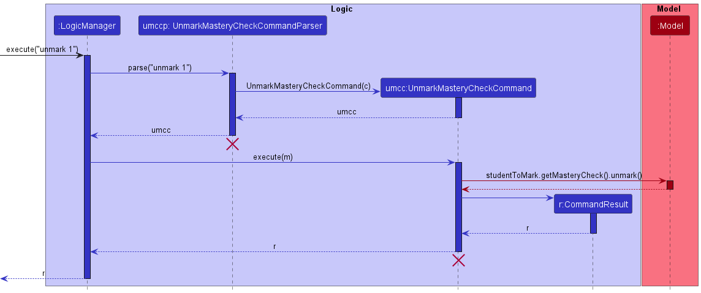

#### Design considerations

**Aspect: Should we allow users to unmark empty Mastery Checks as passed**

|                                                                                   | **Pros**                                                                                                                       | **Cons**                                                                                                                                                             |
|-----------------------------------------------------------------------------------|--------------------------------------------------------------------------------------------------------------------------------|----------------------------------------------------------------------------------------------------------------------------------------------------------------------|
| **Option 1 (current choice)**   Do not allow unmarking of empty Mastery Checks | More intuitive and makes more sense                                                                                            | May be useful in certain cases                                                                                                                                       |
| **Option 2**   Allow marking of empty Mastery Checks                           | Could be useful in certain cases, for example when the user accidentally marks a student with an empty Mastery Check as passed | This would require the marking of empty Mastery Checks to be allowed. Refer to the design considerations in implementing the `mark` command for the cons of doing so |

--------------------------------------------------------------------------------------------------------------------

## **Documentation, logging, testing, configuration, dev-ops**

* [Documentation guide](Documentation.md)
* [Testing guide](Testing.md)
* [Logging guide](Logging.md)
* [Configuration guide](Configuration.md)
* [DevOps guide](DevOps.md)

--------------------------------------------------------------------------------------------------------------------

## **Appendix: Requirements**

### Product scope

**Target user profile**:

* CS1101S Teaching Assistants
* Prefers desktop apps over other types
* Can type fast
* Prefers typing to mouse interactions
* Reasonably comfortable using CLI apps

**Value proposition**
1. One easy-to-access place to track each student’s individual progress
2. Makes TA’s lives easier by removing the need to manually filter students
3. Easier and more convenient to manage and schedule meetings with students
4. Manage students faster than a typical mouse/GUI driven app
5. Constraint: won’t be able to actually grade assignments using FRIDAY

### User stories

Priorities: High (must have) - `* * *`, Medium (nice to have) - `* *`, Low (unlikely to have) - `*`

| Priority | As a …​           | I want to …​                                                        | So that I can…​                                                  |
|----------|-------------------|---------------------------------------------------------------------|------------------------------------------------------------------|
| `* * *`  | user              | add students                                                        |                                                                  |
| `* * *`  | user              | remove students                                                     |                                                                  |
| `* * *`  | user              | add my students’ contact details                                    | contact them when I need to                                      |
| `* * *`  | user              | delete my students’ contact details                                 | remove outdated information                                      |
| `* * *`  | user              | add my students’ grades and marks for tests                         | assess and see how well they are performing                      |
| `* * *`  | user              | delete my students’ grades and marks for tests                      | remove outdated results                                          |
| `* * *`  | user              | add queries from students                                           | keep track and be reminded of the students' questions            |
| `* * *`  | user              | delete certain comments that are no longer relevant                 | not clutter up space with old comments                           |
| `* * *`  | user              | add comments for a specific student                                 | take note of their progress                                      |
| `* * *`  | user              | view the information of a specific student                          | retrieve details about the student                               |
| `* * *`  | user              | search for keywords                                                 | look for information i need from my students                     |
| `* * *`  | user              | be given helpful error messages when I give an invalid command      | troubleshoot easily without consulting the User Guide every time |
| `* * *`  | user              | add dates for my students’ Mastery Checks                           | schedule the meetings                                            |
| `* * *`  | user              | delete dates for my students’ Mastery Checks                        | remove outdated dates and Mastery Checks                         |
| `* *`    | user              | get help in the app itself                                          | get help without consulting the User Guide                       |
| `* *`    | user              | edit my students’ grades and marks for tests                        | update the student’s results                                     |
| `* *`    | user              | edit the contact details of a specific student                      | update the student’s contact details                             |
| `* *`    | user              | edit the information of a specific student                          | update the student’s details.                                    |
| `* *`    | user              | edit previously added comments                                      | update my comments for a student.                                |
| `* *`    | user              | sort my students by Mastery Check dates                             | easily see when is the next Mastery Check.                       |
| `* *`    | user              | sort my students by consultation dates                              | easily see when is the next consultation.                        |
| `* *`    | new user          | see the app populated with sample data                              | easily see how the app will look when it is in use               |
| `* *`    | new user          | purge all current data                                              | get rid of sample/experimental data I used for exploring the app |
| `* *`    | expert user       | create custom alias for my commands                                 | enter commands more efficiently                                  |
| `* *`    | expert user       | delete a custom alias                                               | remove aliases I no longer need                                  |
| `* *`    | intermediate user | generate random pairs to group my students into pairs               | split my students for pair work                                  |
| `*`      | expert user       | view all my current macros                                          | view all my macros and know what they do                         |
| `*`      | expert user       | create my own macros to  perform certain functions                  | be more efficient using the app                                  |
| `*`      | intermediate user | have suggestions on comments to give students for generic  feedback | provide fast feedback                                            |
| `*`      | intermediate user | customize the look and feel of the software                         | make the software feel like my own                               |

### Use cases

For all use cases below, the **System** is `FRIDAY` and the **Actor** is the `user`, unless specified otherwise.

**Use Case 1: Add a student**

**MSS**

1. User requests to add a student with details
2. FRIDAY adds the student

   Use case ends.

**Extensions**

* 1a. The given details are not supported in FRIDAY.

    * 1a1. FRIDAY shows an error message listing the supported details.

      Use case resumes at step 1.

* 1b. The given details are supported but have the wrong format.

    * 1b1. FRIDAY shows an error message providing the correct format.

      Use case resumes at step 1.

 

**Use Case 2: Delete a student**

**MSS**

1.  User requests to list students
2.  FRIDAY shows a list of students
3.  User requests to delete a specific student in the list
4.  FRIDAY deletes the student

    Use case ends.

**Extensions**

* 2a. The list is empty.

  Use case ends.

* 3a. The given index is invalid.

    * 3a1. FRIDAY shows an error message.

      Use case resumes at step 2.

 

**Use Case 3: List a student's details**

**MSS**

1. User requests to list all students
2. FRIDAY shows a list of students
3. User requests to view the details of a specific student in the list
4. FRIDAY displays the details of the student

    Use case ends.

**Extensions**

* 2a. The list is empty.

  Use case ends.

* 3a. The given index is invalid.

    * 3a1. FRIDAY shows an error message.

      Use case resumes at step 2.

 

**Use Case 4: Edit details of a student**

**MSS**

1. User requests to list students
2. FRIDAY shows a list of students
3. User requests to edit details for a specific student in the list
4. FRIDAY edits details for the student

    Use case ends.

**Extensions**

* 2a. The list is empty.

  Use case ends.

* 3a. The given index is invalid.

    * 3a1. FRIDAY shows an error message.

      Use case resumes at step 2.

* 3b. The given details have the wrong formats or tags

    * 3b1. FRIDAY shows an error message.

      Use case resumes at step 2.

 

**Use Case 5: Edit remarks for a student**

**MSS**

1. User requests to list students
2. FRIDAY shows a list of students
3. User requests to edit remarks for a specific student in the list
4. FRIDAY edits details for the student

   Use case ends.

**Extensions**

* 2a. The list is empty.

  Use case ends.

* 3a. The given index is invalid.

    * 3a1. FRIDAY shows an error message.

      Use case resumes at step 2.

* 3b. The given remark is empty.

    * 3b1. FRIDAY removes remarks for the specified student.

      Use case ends.

 

**Use Case 6: Delete details of a student**

**MSS**

1. User requests to list students
2. FRIDAY shows a list of students
3. User requests to delete details for a specific student in the list
4. FRIDAY deletes details for the student

    Use case ends.

**Extensions**

* 2a. The list is empty.

  Use case ends.

* 3a. The given index is invalid.

    * 3a1. FRIDAY shows an error message.

      Use case resumes at step 2.

* 3b. The given details have the wrong formats or tags

    * 3b1. FRIDAY shows an error message.

      Use case resumes at step 2.

 

**Use Case 7: Edit grades for a student**

**MSS**

1. User requests to list students
2. FRIDAY shows a list of students
3. User requests to edit grades for a specific student in the list
4. FRIDAY edits grades for the student

   Use case ends.

**Extensions**

* 2a. The list is empty.

  Use case ends.

* 3a. The given index is invalid.

    * 3a1. FRIDAY shows an error message.

      Use case resumes at step 2.

* 3b. The given score of the grade is empty.

    * 3b1. FRIDAY shows an error message.

      Use case resumes at step 2.

 

**Use Case 8: Sort students**

**MSS**

1. User requests to list students
2. FRIDAY shows a list of students
3. User requests to sort all students with a specific criteria and order
4. FRIDAY displays the students in sorted order

   Use case ends.

**Extensions**

* 2a. The list is empty.

  Use case ends.

* 3a. The given criteria or order is invalid.

    * 3a1. FRIDAY shows an error message listing the accepted criteria and orders.

      Use case resumes at step 3.

* 3b. More than one criterion is given.

    * 3b1. FRIDAY shows an error message.

      Use case resumes at step 3.

 

**Use Case 9: Mark a student's Mastery Check as passed.**

**MSS**

1. User requests to list students
2. FRIDAY shows a list of students
3. User requests to mark the Mastery Check of a specific student as passed
4. FRIDAY marks the student's Mastery Check as passed

   Use case ends.

**Extensions**

* 2a. The list is empty.

  Use case ends

* 3a. The given index is invalid.

    * 3a1. FRIDAY shows an error message.

      Use case resumes at step 2.

* 3b. The Mastery Check of the student has already been marked as passed.

    * 3b1. FRIDAY shows an error message.

      Use case resumes at step 2.

 

**Use Case 10: Unmark a student's Mastery Check.**

**MSS**

1. User requests to list students
2. FRIDAY shows a list of students
3. User requests to unmark the Mastery Check of a specific student
4. FRIDAY unmarks the student's Mastery Check as passed

   Use case ends.

**Extensions**

* 2a. The list is empty.

  Use case ends

* 3a. The given index is invalid.

    * 3a1. FRIDAY shows an error message.

      Use case resumes at step 2.

* 3b. The Mastery Check of the student has not yet been marked as passed.

    * 3b1. FRIDAY shows an error message.

      Use case resumes at step 2.

 

**Use Case 11: Add an alias.**

**MSS**

1. User requests to add alias for a default command
2. FRIDAY adds alias

   Use case ends.

**Extensions**

* 2a. The given alias is invalid.

    * 2a1. FRIDAY shows an error message showing what is an invalid alias.

      Use case resumes at step 1

* 2b. The given default command is invalid.

    * 2b1. FRIDAY shows an error message showing that default command is invalid.

      Use case resumes at step 1

* 2c. The given alias and default command is in the wrong format.

    * 2c1. FRIDAY shows an error message showing the correct format.

      Use case resumes at step 1

* 2d. The given alias already exists in FRIDAY.

    * 2d1. FRIDAY shows an error message showing that alias already exists in FRIDAY.

      Use case resumes at step 1

 

**Use Case 12: Deleting an alias.**

**MSS**

1. User requests to delete an alias
2. FRIDAY deletes alias

   Use case ends.

**Extensions**

* 2a. The given alias is not in FRIDAY.

    * 2a1. FRIDAY shows an error message showing that alias is not in FRIDAY.

      Use case resumes at step 1

* 2b. The given alias is in the wrong format.

    * 2b1. FRIDAY shows an error message showing the correct format.

      Use case resumes at step 1

 

**Use Case 13: Find students**

**MSS**

1. User requests to list students
2. FRIDAY shows a list of students
3. User requests to find students with specific keywords
4. FRIDAY displays the students with matching keywords

   Use case ends.

**Extensions**

* 2a. The list is empty.

  Use case ends.

* 3a. The given command format is invalid.

    * 3a1. FRIDAY shows an error message listing the accepted format.

      Use case resumes at step 3.

 

### Non-Functional Requirements

1. Should work on any _mainstream OS_ as long as it has Java 11 or above installed.
2. Should be able to hold up to 100 students without a noticeable sluggishness in performance for typical usage.
3. Should be able to hold up to 50 aliases without a noticeable sluggishness in performance for typical usage.
4. A user with above average typing speed for regular English text (i.e. not code, not system admin commands) should be able to accomplish most of the tasks faster using commands than using the mouse.

### Glossary

1. **Mainstream OS**: Windows, Linux, Unix, OS-X
2. **Private contact detail**: A contact detail that is not meant to be shared with others
3. **Teaching Assistant:** Teaching assistants (TA) are people who help and support teachers or lecturers to provide and coordinate effective classroom instruction. For CS1101S, teaching assistants are undergraduate students who have completed the module. The role of a CS1101S TA involves planning, preparing and delivering weekly tutorial sessions, marking assignments and monitoring their students' progress and engagement levels.
4. **Reading Assessment**: Assessments in the form of online quiz with Multiple-Choice Questions (MCQ). There are a total of two reading assessments, namely RA1 and RA2, throughout the semester. Reading Assessments have weightage in the students' final grade for the module.
5. **Mastery Check**: An assessment of the students' understanding of topics conducted by the user (the teaching assistants).
There are two Mastery Checks through the semester. Students will be assessed by their knowledge of the topics covered by presenting to their teaching assistant in pairs.
Since users have to arrange dates to meet with their students to conduct the Mastery Checks, FRIDAY allows users to record the scheduled dates for each student.
6. **Default Command**: The original command word for a command in FRIDAY. (e.g. `add`,`sort`)

--------------------------------------------------------------------------------------------------------------------

## **Appendix: Instructions for manual testing**

Given below are instructions to test the app manually.

:information_source: **Note:** These instructions only provide a starting point for testers to work on;
testers are expected to do more *exploratory* testing.

### Launch and shutdown

1. Initial launch

   1. Download the jar file and copy into an empty folder 
   2. Double-click the jar file Expected: Shows the GUI with a set of sample contacts. The window size may not be optimum.

1. Saving window preferences

   1. Resize the window to an optimum size. Move the window to a different location. Close the window. 
   2. Re-launch the app by double-clicking the jar file. 
       Expected: The most recent window size and location is retained.

### Adding a student
1. Adding a student with different details
   1. Prerequisites: A student named `Alex Yeoh` and a student with Telegram handle `tommy123` have already been added.
   2. Test case: `add n/Jacelyn c/2022-07-08`  
      Expected: A student named Jacelyn with consultation date 8 July 2022 is added.
   3. Test case: `add n/alex yeoh`  
      Expected: No student is added. Error details shown in the status message.
   4. Test case: `add n/Tom t/tommy123`  
      Expected: No student is added. Error details shown in the status message.
   5. Other incorrect delete commands to try: `add`, `add Ben`, `add n/`  
      Expected: Similar to previous.
   
### Deleting a student

1. Deleting a student while all students are being shown
   1. Prerequisites: List all students using the `list` command. Multiple students in the list. 
   2. Test case: `delete 1` 
      Expected: First student is deleted from the list. Details of the deleted student shown in the status message. Timestamp in the status bar is updated.
   3. Test case: `delete 0` 
      Expected: No student is deleted. Error details shown in the status message. Status bar remains the same.
   4. Other incorrect delete commands to try: `delete`, `delete x`, `...` (where x is larger than the list size) 
      Expected: Similar to previous.

### Editing a student
1. Editing a student's details
    1. Prerequisites: List all students using the list command. Multiple students in the list.
    2. Test case: edit 1 n/Bobby t/Bobster
       Expected: Edits the first student in the list to have a name of Bobby and a Telegram handle of Bobster
    3. Test case: edit 0 n/Tommy
       Expected: No student is edited. Error details shown in the status message.
    4. Other incorrect formats: edit c/Yelan, edit 1, edit 2 m/.
       Expected: Similar to previous.

### Editing a student's remark
1. Editing a student's remark
    1. Prerequisites: List all students using the list command. Multiple students in the list.
    2. Test Case: remark 1 r/Aspiring to be a CS1101S TA next year
       Expected: Edits the first student in the list to have a remark Aspiring to be a CS1101S TA next year.
    3. Test Case: remark 0 r/Loves Math
       Expected: No student is edited. Error details shown in the status message.
    4. Other incorrect formats: remark r/Loves coding, remark 2, remark 3 r/.
       Expected: Similar to previous.

### Sorting students
1. Sorting students with different criteria and order
    1. Prerequisites: List all students using the `list` command. Multiple students in the list.
    2. Test case: `sort t/a`  
       Expected: Students sorted by Telegram handle in ascending alphabetical order. Students with missing Telegram handles are sorted last.
    3. Test case: `sort m/d`  
       Expected: Students sorted by Mastery Check dates, from latest to earliest. Students with missing Mastery Check dates are sorted first.
    4. Test case: `sort g/a`  
       Expected: Students not sorted. Error details shown in the status message.
    5. Other incorrect delete commands to try: `sort`, `sort n/`, `sort c/b`  
       Expected: Similar to previous.
    
### Finding students
1. Finding students who matches user input keywords
    1. Prerequisites: List all students using the `list` command. Multiple students in the list.
    2. Test case: `find alex`  
       Expected: Students whose name or remark or telegram handle containing alex will be displayed.

### Adding aliases
1. Adding different aliases
    1. Prerequisites: An alias `del` has been added for `delete`.
    2. Test case: `alias a/ls k/list`  
       Expected: An alias ls is added for the list command.
    3. Test case: `alias a/del k/add`  
       Expected: No alias is added. Error details shown in the status message.

### Deleting aliases
1. Deleting aliases
    1. Prerequisites: An alias del has been added for delete.
    2. Test case: unalias a/del  
       Expected: The alias del is deleted.
    3. Test case: unalias a/ls  
       Expected: No alias is deleted. Error details shown in the status message.
   
### Recording grades for students
1. Editing the grades of a student
    1. Prerequisites: List all students using the `list` command. Multiple students in the list. The index provided is  
       valid and the student exists.
    2. Test case: `grade 1 ra1/95.60`
       Expected: Edits the first student in the list to have a score of 95.60 in their RA1 grade.
    3. Test case: `grade 0 ra2/90`
       Expected: No student is edited. Error details shown in the status message.
    4. Other incorrect formats: `grade 3, grade ra1/50, grade 2 pa/A, grade 1 ft/200, grade 1 mt/90.33333`
       Expected: Similar to previous.

### Recording grades for students
1. Editing the grades of a student
    1. Prerequisites: List all students using the list command. Multiple students in the list. The index provided is  
       valid and the student exists.
    2. Test case: grade 1 ra1/95.60
        1. Expected: Edits the first student in the list to have a score of 95.60 in their RA1 grade.
    3. Test case: grade 0 ra2/90
        1. Expected: No student is edited. Error details shown in the status message.
    4. Other incorrect formats: grade 3, grade ra1/50, grade 2 pa/A, grade 1 ft/200, grade 1 mt/90.33333
       Expected: Similar to previous.

### Marking and unmarking a student's Mastery Check

1. Marking a student's Mastery Check as passed

    1. Prerequisites: A student with Mastery Check date 2020-09-01, a student with Mastery Check date 2050-01-02 and a student with no scheduled Mastery Check date have already been added.
    2. Test case: mark 1
       Expected: The Mastery Check of the first student is marked as passed. A "(passed)" string is added behind the Mastery Check date of student 1.
    3. Test case: mark 2
       Expected: No marking of any Mastery Checks as passed is done. Error details shown in status message.
    4. Other incorrect mark commands to try: mark, mark 3, ...
       Expected: Similar to previous.

2. Unmarking a student's Mastery Check

    1. Prerequisites: A student with Mastery Check already marked as passed and a student with Mastery Check date of 2021-03-04 (not marked as passed yet) have already been added.
    2. Test case: unmark 1
       Expected: The Mastery Check of the first student is unmarked. The "(passed)" string behind student 1's Mastery Check date is removed.
    3. Test case: unmark 2
       Expected: No unmarking of any Mastery Checks is done. Error details shown in status message.
    4. Other incorrect unmark commands to try: unmark, unmark 0,

### Saving data

1. Dealing with missing/corrupted data files

   1. Prerequisites: There is a friday.json file in the data folder.
   2. Test case: Add in `{ "name" : "@num",
      "telegramHandle" : "",
      "consultation" : "0001-01-01",
      "masteryCheck" : "0001-01-01",
      "masteryCheckIsDone" : false,
      "remark" : "",
      "tagged" : [ ],
      "gradesList" : [ "0", "0", "0", "0", "0" ]
      } ` into the list "students" in the friday.json file.
      Expected: Friday will not load the student list. Error details shown in the logs.

## **Appendix: Effort**
<b>FRIDAY</b> was built over a period of 6 weeks. It is build upon, AddressBook Level-3, as well as design,plan out and implement<b>FRIDAY</b> 

### Difficulty level

We believe that we have worked hard during this entire project to come with a product that is functional and widely applicable.
If the difficulty of the individual project is a 5 the difficulty of implementing <b>FRIDAY</b> was a 5. This is because:

* We pushed more complex designs and features that required more planning and trial and error and learning along the way.
* Working as a team also meant that we had to delegate admin tasks and designate roles on a weekly basis which was a challenge for us as well.

### Challenges Faced

* Evolving and refactoring existing code from AB3 resulted in many problems, such as:
    * Existing automated test cases failing due to changes in naming.
    * The refactoring was not done correctly in certain places, resulting in unexpected changes in file names which made it seem like we lost certain essential files.

* Dealing with time delay due to different and clashing schedules of each team member.

* Forking workflow made working on the project at the same time inefficient, especially when multiple members were working on the same file.

### Effort required
When this projects work was compared to the amount of effort needed for the IP, it can be said that the same amount of effort
if not more was put into this project as compared to the IP. We believe we put in 100% of the effort each one of us put into our IP and that's a conservative estimate. This project required all members working around the clock
and a high amount of effort was used to achieve weekly deliverables and ensure a working product was available at all times. 

### Achievements
* UI redesigned to match a more aesthetically pleasing and purposeful look.
* Additional features for extra functionality , such as ability to record the particular grades for individual students,
  the ability to sort the list of students based on our students' attributes,
  the ability to mark mastery checks as done or undone,
  the ability to add alias for commands,
* Addition of new tests for the new commands.
* Greater understanding of real world software engineering practices.
* Greater appreciation for teamwork and timeliness.
